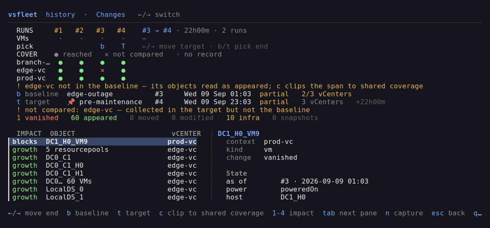

# vsfleet

<p align="center">
  <a href="https://github.com/easonliuuuuu/vsfleet/actions/workflows/ci.yml"></a>
  <a href="https://github.com/easonliuuuuu/vsfleet/releases"></a>
  <a href="go.mod"></a>
  <a href="LICENSE"></a>
</p>

<p align="center">
  <strong>Operate multiple VMware vCenter servers from one terminal.</strong>
</p>

<p align="center">
  <picture>
    <source media="(prefers-reduced-motion: reduce)" srcset="docs/assets/vsfleet.png">
    
  </picture>
</p>

<p align="center"><sub>Healthy inventory stays usable even when another vCenter is offline.</sub></p>

---

<details>
<summary><strong>Table of Contents</strong></summary>

- [About](#about)
- [Why vsfleet?](#why-vsfleet)
- [Feature Comparison](#feature-comparison)
- [Install](#install)
  - [Pre-built Binaries](#pre-built-binaries-recommended)
  - [With Go](#with-go)
  - [From a Checkout](#from-a-checkout)
  - [Shell Autocompletion](#shell-autocompletion)
- [Quick Start](#quick-start)
- [Common Commands](#common-commands)
- [Assessment History](#assessment-history)
- [Terminal UI](#terminal-ui)
  - [Keybindings Reference](#keybindings-reference)
  - [Background Refresh & Caching](#background-refresh--caching)
  - [Filtering and Searching](#filtering-and-searching)
- [Operator Recipes](#operator-recipes)
- [Configuration](#configuration)
  - [Credentials](#credentials)
  - [Network Routes](#network-routes)
  - [TLS Policies](#tls-policies)
- [Troubleshooting](#troubleshooting)
- [Architecture & Design](#architecture--design)
- [Development & Contributing](#development--contributing)
- [Security](#security)
- [License](#license)

</details>

---

## About

**vsfleet** is an open-source Go CLI and interactive terminal UI (TUI) built for
VMware vSphere operators and site reliability engineers.

It organizes each vCenter into a named **context**—analogous to contexts in
`kubectl`—keeping endpoints, credentials, network routes, and certificate
policies strictly separated. You can inspect VMs, templates, hosts, clusters,
vApps, datastores, and networks across a single vCenter or an entire multi-datacenter
estate without juggling browser tabs or writing brittle scripts.

> [!IMPORTANT]
> **Strict Read-Only Safety Guarantee**
> vsfleet is an inspection and diagnostic tool. It is strictly read-only: it does
> not power on/off VMs, create or revert snapshots, modify networks, provision
> resources, or delete inventory objects.

---

## Why vsfleet?

Modern infrastructure often distributes vCenters across different network paths
and security tiers: a local lab reached directly, production clusters behind
corporate HTTP/HTTPS CONNECT proxies, and customer enclaves reached via
isolated SOCKS5 tunnels.

vsfleet bridges this divide:

* **Single-Command Estate Queries:** Query resources across all vCenters with `--all-contexts`.
* **Instant Cross-Estate Search:** Locate VMs, templates, or networks across every configured vCenter simultaneously.
* **Fault-Tolerant Resilience:** If one vCenter is offline or timing out, results from healthy vCenters remain fully usable.
* **Zero Plaintext Passwords:** Passwords stay in the operating system's native secret store (Keyring/Keychain) or interactive prompt, never in `config.toml`.
* **Pin Pinned TLS Thumbprints:** Enforce SHA-256 or SHA-1 fingerprints against untrusted or self-signed certificates.
* **Granular Failure Diagnosis:** Step-by-step stage diagnosis (`vsfleet doctor`) pinpoints proxy, DNS, TCP, TLS, and auth issues.
* **Historical Drift Ledger:** Capture immutable VM and snapshot observations in SQLite, then compare runs to explain appeared, vanished, moved, and aging snapshots.
* **Interactive & Scriptable:** Rich Bubble Tea TUI for humans; clean JSON output (`-o json`) for automation and `jq`.

---

## Feature Comparison

| Capability | `vsfleet` | `govc` | PowerCLI | vSphere Web Client |
|---|:---:|:---:|:---:|:---:|
| **Multi-vCenter querying in 1 command** | **Yes (`--all-contexts`)** | No (1 target per run) | Script loop required | No (separate logins) |
| **Estate-wide cross-resource search** | **Yes (`vsfleet search`)** | No | Slow custom script | Per-vCenter search |
| **Fault-tolerant partial results** | **Yes (retains healthy data)** | No (fails entire run) | Requires custom `try/catch` | Browser tab timeout |
| **Heterogeneous proxy routing** | **Per-context (SOCKS5/HTTP/HTTPS)** | Global env vars only | Global env vars only | Browser proxy |
| **Zero plaintext passwords on disk** | **OS Keyring / Prompt** | Env / Session file | Credential store / script | Browser cache |
| **Interactive Terminal UI (TUI)** | **Yes (live background refresh)** | No (CLI only) | No | Web browser only |
| **Historical VM drift + snapshot age** | **Yes (SQLite ledger + diff)** | Point-in-time exports | Custom scripting | Point-in-time view |
| **Accidental mutation risk** | **Zero (Read-only guarantee)** | Moderate (Read/Write) | High (Read/Write) | High (Read/Write) |

---

## Install

### Homebrew (macOS and Linux)

Install the latest release from the project's Homebrew tap:

```sh
brew install --cask easonliuuuuu/tap/vsfleet
```

### Pre-built Binaries (Recommended)

Download the latest pre-compiled binary for your operating system and CPU architecture
from [GitHub Releases](https://github.com/easonliuuuuu/vsfleet/releases):

```sh
# Example for Linux (x86_64)
curl -sSL https://github.com/easonliuuuuu/vsfleet/releases/latest/download/vsfleet_linux_amd64.tar.gz | tar -xz vsfleet
sudo install -m 0755 vsfleet /usr/local/bin/
```

Available binary archives are provided for:
* **Linux:** `amd64`, `arm64` (`.tar.gz`)
* **macOS:** Apple Silicon (`arm64`), Intel (`amd64`) (`.tar.gz`)
* **Windows:** `amd64`, `arm64` (`.zip`)

### With Go

Requires Go 1.25 or newer:

```sh
go install github.com/easonliuuuuu/vsfleet/cmd/vsfleet@latest
```

### From a Checkout

```sh
git clone https://github.com/easonliuuuuu/vsfleet.git
cd vsfleet
go build -o vsfleet ./cmd/vsfleet
```

### Shell Autocompletion

vsfleet includes built-in autocompletion for Bash, Zsh, Fish, and PowerShell:

```sh
# Bash (Linux)
vsfleet completion bash > ~/.local/share/bash-completion/completions/vsfleet

# Bash (macOS with Homebrew bash-completion)
vsfleet completion bash > $(brew --prefix)/etc/bash_completion.d/vsfleet

# Zsh
vsfleet completion zsh > "${fpath[1]}/_vsfleet"

# Fish
vsfleet completion fish > ~/.config/fish/completions/vsfleet.fish
```

---

## Quick Start

### 1. Interactive First Run
If no contexts exist, running `vsfleet` launches the setup wizard directly:

```sh
vsfleet
```

You can also run the setup wizard from the command line:

```sh
vsfleet context add
```

The wizard prompts for endpoint, username, connection route, certificate policy,
and password, validating the connection before saving.

### 2. Basic Exploration

```sh
# List and test configured contexts
vsfleet context list
vsfleet context test prod
vsfleet status

# Inspect inventory on the current context
vsfleet vm list
vsfleet vapp list
vsfleet host list
vsfleet datastore list

# Search across the entire estate
vsfleet search ubuntu --all-contexts
```

### Assessment History

Assessments are explicit, read-only captures of VM, host, cluster, datastore,
and snapshot state. They are
stored locally in SQLite and never sent back to vCenter:

```sh
vsfleet assessment run --all-contexts
vsfleet assessment run --all-contexts --label nightly --note "pre-change baseline" --pin
vsfleet assessment list
vsfleet assessment diff previous latest
vsfleet assessment diff nightly latest --fail-on moved,vanished --max-snapshot-age 30d --require-complete
vsfleet assessment snapshots --older-than 30d
vsfleet assessment trends churn
vsfleet assessment trends snapshots --older-than 30d
vsfleet assessment trends capacity --kind all
vsfleet assessment report latest
vsfleet assessment export latest --format rvtools --file ./estate.xlsx
vsfleet assessment doctor
vsfleet assessment prune --older-than 90d       # dry-run
vsfleet assessment backup ./history-backup.db
vsfleet vm history billing --all-observations
```

Diffs compare only vCenters collected successfully in both runs, so an outage
cannot masquerade as mass VM deletion. Runs can carry unique labels and notes;
pin a baseline to protect it from deletion, then use
`assessment update <run> --unpin` before removing it. `assessment diff` returns
exit code `2` for a requested drift-policy violation (`1` remains an execution
or selector error), which makes it suitable for cron, CI, or systemd timers.
Use `--history-db <path>` or `VSFLEET_HISTORY_DB` to choose the database
location.

`assessment export` is an offline writer: it reads the selected persisted run
and does not contact vCenter or open a live session. The `rvtools` format is an
XLSX workbook containing `vInfo`, per-VM `vDisk` and `vNetwork`, `vHost`,
`vCluster`, `vDatastore`, `vSnapshot`, and the `vsfleetCoverage` provenance
sheet. The destination is
required and existing files need `--force`; exporting the same run twice
produces byte-identical output.

The policy flags are intentionally command-line only so a scheduled job is
auditable from its invocation:

```sh
# cron: capture, then compare the named baseline to the newest run
vsfleet assessment run --all-contexts --label nightly
vsfleet assessment diff nightly latest --fail-on appeared,vanished,moved \
  --fail-on snapshot-created,snapshot-removed --max-snapshot-age 30d \
  --require-complete -o json > drift.json
```

Only one mutating operation may write a history database at a time. Capture,
prune, backup, and restore use a fenced lease; listing, diffing, and opening
the TUI never take that lease. Prune is a dry run unless `--execute` is passed.
Backups are consistent SQLite snapshots. `assessment restore --force` creates
an automatic pre-restore safety copy before replacing the active database.

---

## Common Commands

| Command | Purpose |
|---|---|
| `vsfleet` | Open the interactive terminal UI (default) |
| `vsfleet ui` | Open the terminal UI explicitly |
| `vsfleet context add` | Add a new vCenter context via wizard |
| `vsfleet context list` | List all configured contexts |
| `vsfleet context show [name]` | Show configuration and route details for a context |
| `vsfleet context use <name>` | Select the active context |
| `vsfleet context test <name>` | Test connectivity and authentication for a context |
| `vsfleet context remove <name>` | Remove a context and invalidate open sessions |
| `vsfleet status` | Health check and summary of selected contexts |
| `vsfleet doctor [context...]` | Run an 8-stage connection diagnosis |
| `vsfleet search <text>` | Search inventory across all resource kinds |
| `vsfleet assessment run` | Capture VM, host, cluster, datastore, and snapshot state from selected contexts |
| `vsfleet assessment diff [base] [target]` | Explain VM drift and optionally enforce a policy |
| `vsfleet assessment snapshots` | Report snapshot age and first/last observation |
| `vsfleet assessment trends ...` | Trend VM churn, snapshot age, and capacity over complete runs |
| `vsfleet assessment report [run]` | Summarize one run's coverage, counts, and capacity |
| `vsfleet assessment export [run] --format rvtools --file FILE` | Export a persisted run as deterministic RVTools-compatible XLSX |
| `vsfleet assessment prune` | Dry-run or execute retention cleanup |
| `vsfleet assessment backup FILE` | Create a consistent SQLite backup |
| `vsfleet assessment restore FILE` | Validate and restore a backup in place |
| `vsfleet assessment doctor` | Check schema, integrity, coverage tables, and lease state |
| `vsfleet assessment update <run>` | Edit a run label, note, or pin |
| `vsfleet vm history <name-or-uuid>` | Show a VM's change timeline across stored runs |
| `vsfleet <kind> list` | List resources (`vm`, `template`, `host`, `cluster`, `vapp`, `datastore`, `network`) |

Supported resource kinds are `vm`, `template`, `host`, `cluster`, `vapp`,
`datastore`, and `network`. Each kind also accepts `--filter` / `-f`:

```sh
vsfleet host list --context prod --filter esxi-07
vsfleet datastore list --all-contexts -f nvme
vsfleet vapp list --all-contexts
```

Emit machine-readable JSON using `-o json` for scripting:

```sh
vsfleet vm list --all-contexts -o json
vsfleet search nvme --kind datastore -o json
```

### Useful Global Flags

| Option | Description |
|---|---|
| `--context <name>` | Scope command to a specific context (repeatable) |
| `--all-contexts` | Target every configured context |
| `--config <path>` | Override configuration file path |
| `--timeout <duration>` | Per-vCenter request timeout (default: `30s`) |
| `-o, --output json` | Emit JSON output instead of formatted tables |
| `--refresh <duration>` | Set background TUI polling interval (default: `20s`) |
| `--history-db <path>` | Override the local SQLite assessment database |

---

## Terminal UI

Run `vsfleet` to browse your estate interactively. The interface gives you a
dense, real-time table of your resources with immediate context switching and
diagnostics.

### Keybindings Reference

#### Browse Screen

| Workflow | Key | Action |
|---|---|---|
| **Resource Switching** | <kbd>1</kbd>–<kbd>7</kbd> | Jump directly to a resource tab (`1`: VMs, `2`: Templates, `3`: Hosts, `4`: Clusters, `5`: Datastores, `6`: Networks, `7`: vApps) |
| | <kbd>h</kbd> / <kbd>l</kbd> or <kbd>←</kbd> / <kbd>→</kbd> | Cycle horizontally between resource tabs |
| **Row Navigation** | <kbd>k</kbd> / <kbd>j</kbd> or <kbd>↑</kbd> / <kbd>↓</kbd> | Move up / down through rows |
| | <kbd>Enter</kbd> | Open detail inspector for highlighted row |
| **Scope & Contexts** | <kbd>c</kbd> | Open the Contexts management screen |
| | <kbd>a</kbd> | Toggle between current context and all-contexts view |
| **Search & Filter** | <kbd>/</kbd> | Filter current table in real-time |
| | <kbd>Tab</kbd> | Widen active filter to an estate-wide global search |
| | <kbd>Esc</kbd> | Clear filter and restore normal view |
| **Operations** | <kbd>r</kbd> / <kbd>R</kbd> | Reload current context / Reload all contexts |
| | <kbd>d</kbd> | Run diagnostic doctor on the selected row's vCenter |
| | <kbd>?</kbd> | Show on-screen key reference overlay |
| | <kbd>q</kbd> | Quit |

#### Contexts Screen (<kbd>c</kbd>)

| Key | Action |
|---|---|
| <kbd>Enter</kbd> | Select highlighted context and return to table |
| <kbd>a</kbd> | Show all contexts simultaneously |
| <kbd>n</kbd> / <kbd>e</kbd> / <kbd>x</kbd> | Add / Edit / Remove context |
| <kbd>d</kbd> | Diagnose connectivity to highlighted context |
| <kbd>Esc</kbd> | Return to the browse screen |

#### History Screen (<kbd>H</kbd>)

The full-screen History hub opens Changes, Trends, and Runs; press <kbd>←</kbd>
or <kbd>→</kbd> to switch panes. Changes compares the newest two assessments.
Press
<kbd>b</kbd> or <kbd>t</kbd> to choose a different baseline or target run,
<kbd>n</kbd> to capture every configured vCenter, and <kbd>Enter</kbd> to open
the selected change. From a change detail, press <kbd>h</kbd> to open that VM's
timeline; press <kbd>a</kbd> there to include unchanged observations. In Runs,
<kbd>e</kbd> edits a label, <kbd>n</kbd> edits a note, and <kbd>p</kbd> toggles a
pin. Run pickers show labels and pinned baselines. Captures are explicit and
run in the background; normal inventory remains available while the ledger is
updated.

### Background Refresh & Caching

Inventory updates quietly in the background without flickering or resetting
cursor position:

* **Selected Context:** Re-read every 20 seconds.
* **Visited Contexts:** Successfully loaded contexts are re-read every 200
  seconds. A context waiting for interactive credentials is retried only when
  selected or explicitly reloaded, so background polling never opens a
  password prompt.
* **Unvisited Contexts:** Never contacted until explicitly accessed.
* **Failure Tolerance:** If a refresh fails, cached inventory remains on screen
  with a visual warning rather than clearing the display.
* **Custom Intervals:** Adjust with `--refresh` (e.g., `vsfleet --refresh 5s` or
  `vsfleet --refresh -1` to disable background timers).

### Filtering and Searching

1. Press <kbd>/</kbd> to filter the current view by name.
2. If more matches exist outside the current view, the query line alerts you:
   ```text
   /ubuntu   0 here · 2 in the estate — tab to widen
   ```
3. Press <kbd>Tab</kbd> to widen the query to every vCenter and resource kind
   across inventory already cached in memory.
4. Press <kbd>Tab</kbd> again or <kbd>Esc</kbd> to narrow back to your previous
   context with the query preserved.

---

## Operator Recipes

### 1. Estate-wide Search with `jq`
Audit all VMs matching a specific OS across all vCenters and extract IP addresses:

```sh
vsfleet vm list --all-contexts -o json | \
  jq -r '.[] | select(.Name | test("ubuntu"; "i")) | "\(.Context)\t\(.Name)\t\(.IPAddress)"'
```

### 2. Unattended Setup in CI / Automation
Configure a context without interactive prompts using `--password-stdin`:

```sh
printf '%s\n' "$VCENTER_PASSWORD" | \
  vsfleet context add \
    --name prod \
    --endpoint https://vcsa.example.internal \
    --username administrator@vsphere.local \
    --credential keyring:prod \
    --password-stdin \
    --tls system
```

### 3. Isolated Customer Enclave via SOCKS5 & Remote DNS
Reach an isolated vCenter whose hostname only resolves inside an internal bastion:

```sh
vsfleet context add \
  --name customer-a \
  --endpoint https://vcsa.customer-a.internal \
  --username operator@vsphere.local \
  --credential keyring:customer-a \
  --transport socks5 \
  --proxy-address 127.0.0.1:1080 \
  --remote-dns \
  --tls thumbprint
```

### 4. Real-time Migration Watcher
Monitor live VM movements across hosts and datastores with an accelerated refresh rate:

```sh
vsfleet --refresh 3s
```

---

## Configuration

The default configuration file is located at:

```text
~/.config/vsfleet/config.toml
```

Override this location using `--config <path>` or the `VSFLEET_CONFIG`
environment variable. The configuration file is created with `0600` permissions
and contains **no passwords**.

Assessment history is kept separately in SQLite (schema version 3). By default it lives at
`<user-config-dir>/vsfleet/history.db` (for example, `~/.config/vsfleet/history.db`);
set `VSFLEET_HISTORY_DB` or pass `--history-db` to override it. The database is
created with a private directory and `0600` file permissions and contains VM
inventory, UUIDs, paths, annotations, snapshot metadata, and host/cluster/
datastore observations, but never credentials.

### Example `config.toml`

```toml
version = 1
current_context = "prod"

[[contexts]]
name = "prod"
endpoint = "https://vcsa.example.internal"
username = "administrator@vsphere.local"
credential = "keyring:prod"

[contexts.transport]
type = "direct"

[contexts.tls]
mode = "system"

[[contexts]]
name = "customer-enclave"
endpoint = "https://vcsa.enclave.internal"
username = "readonly@vsphere.local"
credential = "keyring:customer-enclave"

[contexts.transport]
type = "socks5"
proxy_address = "127.0.0.1:1080"
remote_dns = true

[contexts.tls]
mode = "thumbprint"
thumbprint = "1A:2B:3C:4D:5E:6F:..."
```

### Credentials

The `credential` field specifies how passwords are resolved:

| Value | Behavior |
|---|---|
| `keyring:<name>` | Read password securely from the OS secret store |
| `prompt` | Prompt interactively on each run; store nothing on disk |

> [!NOTE]
> **Headless Environments**
> On systems without an active desktop Secret Service (such as headless servers,
> SSH bastions, or containers), `context add` automatically records `credential = "prompt"`
> with an explanatory warning. This ensures automated workflows proceed smoothly.

### Network Routes

| Transport | Behavior |
|---|---|
| `direct` | Connect directly with local DNS resolution |
| `socks5` | Connect through SOCKS5 proxy; `--remote-dns` resolves hostnames via proxy |
| `http` | Tunnel through an HTTP CONNECT forward proxy |
| `https` | Tunnel through an HTTPS CONNECT forward proxy with TLS |

### TLS Policies

| Policy | Behavior |
|---|---|
| `system` | Verify certificates against system trust store |
| `thumbprint` | Pin SHA-256 or SHA-1 certificate fingerprint |
| `insecure` | Disable verification (use only when strictly necessary) |

When `--tls thumbprint` is chosen without an explicit thumbprint, the setup wizard
fetches the remote certificate, displays its fingerprints, and pins it with your
confirmation.

---

## Troubleshooting

Diagnose connection issues step-by-step:

```sh
vsfleet context show prod       # Inspect endpoint, route, and TLS parameters
vsfleet context test prod       # Test the complete connection end-to-end
vsfleet doctor prod             # Run 8-stage connection diagnosis
vsfleet status                  # Health-check every selected context
```

### The 8-Stage Diagnostic Pipeline
`vsfleet doctor` verifies connection stages in order:
1. **Configuration:** Validates TOML properties.
2. **Credentials:** Tests keyring or prompt resolution.
3. **Routing & Proxy:** Confirms proxy reachability and auth.
4. **DNS Resolution:** Resolves hostname (locally or remotely).
5. **TCP Handshake:** Verifies port 443 connectivity.
6. **TLS Negotiation:** Validates certificate chain or pinned thumbprint.
7. **SSO Authentication:** Authenticates vSphere credentials.
8. **API Handshake:** Tests read access to vSphere ServiceContent.

---

## Architecture & Design

vsfleet is structured into modular layers designed for high concurrency,
memory safety, and partial-failure resilience.

* See [docs/ARCHITECTURE.md](docs/ARCHITECTURE.md) for full architecture diagrams,
  component models, design invariants, and package codemaps.

---

## Development & Contributing

Contributions are welcome! Please see [CONTRIBUTING.md](CONTRIBUTING.md) for complete
guidelines on local setup, testing, and code conventions.

### Running Tests
```sh
go test -race ./...
go vet ./...
```

### Developing Offline with the Synthetic Testbed
You do not need real vCenter credentials or hardware to work on vsfleet. Launch
the deterministic presentation backend:

```sh
go run ./cmd/vsfleet-demo
```

### Regenerating the Demo GIF
To regenerate `docs/assets/vsfleet.gif` and `docs/assets/vsfleet.png` using [VHS](https://github.com/charmbracelet/vhs):

```sh
vhs docs/demo.tape
```

---

## Security

For security policies, credential storage details, and vulnerability reporting
procedures, please refer to [SECURITY.md](SECURITY.md).

---

## License

[MIT](LICENSE) © Eason Liu
