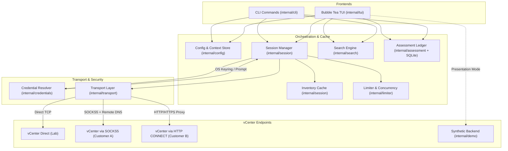

# Architecture of vsfleet

This document provides a bird's-eye view of vsfleet's internal architecture,
system topology, design invariants, source code structure, and cross-cutting
concerns. It is intended for contributors and operators who want to understand
how vsfleet operates across multiple heterogeneous VMware vCenters.

---

## 1. Bird's-Eye Overview

Managing multiple VMware vCenters is traditionally fraught with two challenges:
1. **Network heterogeneity:** Different vCenters live in different security zones (direct local networks, jumpboxes, SOCKS5 tunnels, or HTTP/HTTPS CONNECT proxies).
2. **Operational friction:** Official tools (`govc`, PowerCLI, vSphere Web Client) either target one vCenter at a time or require heavy scripting that fails completely when a single endpoint is unreachable.

vsfleet solves this by decoupling **contexts** (endpoints, credentials, transports, and TLS policies) from operations (CLI queries, estate-wide searches, and interactive terminal browsing).



---

## 2. Core Design Invariants

Every change to vsfleet must uphold these four architectural invariants:

### 1. Strict Read-Only Safety
vsfleet is an inspection and diagnostic tool. Under no circumstances should
write, power-state mutation, snapshot creation/reversion, provisioning, or
deletion RPCs be introduced to [internal/vsphere](file:///home/easonliu/projects/vsfleet-wt/internal/vsphere). Operators must be able to run
vsfleet in production environments with absolute certainty that no state will
be altered.

### 2. Fault Isolation & Partial Success
An outage or misconfiguration in one vCenter must never cause a multi-context
operation to abort.
* In the CLI: If 3 of 4 vCenters respond and 1 times out, results from the 3
  healthy vCenters are displayed, and the failure for the 4th is reported
  separately with diagnostic context.
* In the TUI: Failed contexts are marked clearly in the status gutter, while
  cached inventory for healthy contexts remains interactive.
* In inventory listing: If one resource kind (e.g., datastores) fails to query
  on an overloaded vCenter, available resources (e.g., VMs and hosts) are still
  returned.

### 3. Zero Credential Persistence on Disk
Plaintext passwords are never written to `config.toml` or state files.
* Credentials are stored in the platform's native secret service via
  [zalando/go-keyring](https://github.com/zalando/go-keyring) (Linux Secret Service, macOS Keychain, Windows Credential Manager).
* When run on headless systems without a secret store, credentials gracefully
  fall back to interactive prompt mode (`prompt`) without failing the workflow.
* Password prompts are masked, and credentials held in memory are discarded when
  sessions are terminated.

### 4. Context Isolation & Deterministic Invalidation
A context name is a label for a configuration set, not an identity:
* Editing a context (e.g., updating its proxy, username, or TLS mode)
  immediately terminates existing client sessions and purges associated cached
  inventory.
* Removing a context sends an explicit logout to the vCenter session rather than
  leaving orphaned sessions on the server.

### 5. Historical Observations Are Immutable and Coverage-Aware
The assessment ledger is a local observation store, not a second source of
truth. Each explicit capture records the VM and snapshot state returned by
vCenter at that point in time. A diff identifies VMs by managed-object
reference, then instance UUID or BIOS UUID, and reports moves only when both
observations are unambiguous. Lifecycle claims are made only for vCenters that
completed collection in both runs; failed or missing coverage produces a
warning instead of false vanish/appear events.

Schema version 3 adds per-kind collection coverage and immutable host, cluster,
and datastore observations. Resource diffs use vCenter plus managed-object
reference identity and keep volatile utilization/state fields behind
`--include-runtime`. Trends aggregate estate totals before context/resource
drill-downs, and every JSON trend/report envelope carries a schema version.
Run labels, notes, pinning, and the renewable fenced lease from schema version 2
remain intact; the lease also serializes prune, backup, and restore operations.
The TUI's History hub switches between Changes, Trends, and Runs, while all
destructive ledger maintenance stays explicit on the CLI.

The `assessment export` command reads a selected finished run through one
SQLite read transaction and passes it to the `internal/report` writer. It never
loads configuration or credentials and never creates a session. The RVTools
writer emits fixed, coverage-aware sheets (including per-VM disk and network
inventory) with canonical ordering and
normalizes XLSX ZIP entry order and timestamps, so two exports of unchanged
stored evidence are byte-identical.

---

## 3. Source Code Organization

```
vsfleet/
├── cmd/
│   ├── vsfleet/           # Production CLI & TUI entrypoint
│   └── vsfleet-demo/      # Deterministic synthetic binary for VHS tapes & UI testing
├── docs/
│   ├── assets/            # Demo recordings (.gif) and screenshots (.png)
│   ├── ARCHITECTURE.md    # System design, invariants, and codemap (this document)
│   └── demo.tape          # VHS tape definition for generating demo recordings
├── internal/
│   ├── assessment/        # SQLite run ledger, coverage-aware diffs, VM history
│   ├── cli/               # Cobra command handlers (root, context, doctor, vm, search, etc.)
│   ├── config/            # TOML config parser, context definitions, path discovery
│   ├── contextops/        # High-level context lifecycle (add, edit, remove, test)
│   ├── credentials/       # Keyring and interactive prompt credential providers
│   ├── demo/              # In-memory synthetic vCenter backend for offline demos
│   ├── humanize/          # Output humanization (bytes, durations, frequencies)
│   ├── limiter/           # Concurrency limiters and rate throttles
│   ├── search/            # Cross-vCenter estate search engine
│   ├── session/           # Session management, caching, and connection pooling
│   ├── transport/         # Network dialers (Direct, SOCKS5, HTTP/HTTPS CONNECT)
│   ├── tui/               # Charmbracelet Bubble Tea terminal user interface
│   ├── uistate/           # Persistent UI view state (last visited tab, context)
│   ├── version/           # Build-time version metadata (injected by GoReleaser)
│   └── vsphere/           # VMware govmomi wrappers, stage diagnosis, inventory models
└── tests/                 # Integration tests with vSphere simulator and proxy tests
```

---

## 4. Subsystem Details

### Transport & Connectivity (`internal/transport`)
The transport layer provides a unified `net.Dialer` interface regardless of the
underlying route:
* **Direct**: Standard local TCP dialer with local DNS resolution.
* **SOCKS5**: Supports authenticated proxying and `--remote-dns` to resolve
  vCenter hosts within the destination network enclave.
* **HTTP / HTTPS CONNECT**: Tunnels TCP connections through standard forward
  proxies, including proxy basic authentication and TLS verification for HTTPS
  proxies.

### Diagnostic Pipeline (`internal/cli/doctor.go` & `internal/vsphere/stage.go`)
The `vsfleet doctor` command executes an 8-stage pipeline in strict sequence to
diagnose exact point-of-failure:
1. **Configuration**: Validates TOML schema and context properties.
2. **Credentials**: Confirms OS keyring accessibility or prompt availability.
3. **Route & Proxy**: Confirms proxy reachability and proxy authentication.
4. **DNS**: Resolves vCenter hostname (locally or remotely via proxy).
5. **TCP**: Establishes transport handshake to port 443.
6. **TLS**: Validates certificate chain or compares pinned SHA-256/SHA-1 thumbprint.
7. **Authentication**: Performs vSphere SSO authentication.
8. **API**: Executes basic vSphere ServiceContent probe.

### Background Polling & Cache (`internal/session`)
The TUI maintains a quiet background refresh model:
* Startup may reuse a session or stored keyring credential automatically, but
  an interactive credential boundary settles into `credentials required`
  until an explicit context selection or reload opens the masked prompt.
* Active context inventory is polled every 20 seconds.
* Inactive, successfully loaded contexts are polled every 200 seconds.
  Contexts waiting for interactive credentials require an explicit selection
  or reload; a background timer never takes over the terminal with a prompt.
* Unvisited contexts are never polled until explicitly brought into scope.
* Failures do not blank the screen: the cache retains stale inventory, visually
  noting the last-known timestamp and the connection issue.

---

## 5. Development & Testing Strategy

1. **Synthetic Presentation Backend (`cmd/vsfleet-demo`)**:
   Enables 100% offline development and styling of the Bubble Tea TUI. It generates
   realistic, deterministic inventory across three simulated vCenters with zero
   credentials or VMware dependencies.
2. **In-Process VMware Simulator (`tests/`)**:
   Integration tests run against `govmomi/simulator` and in-memory proxy listeners,
   allowing complete end-to-end tests in CI without external infrastructure.
